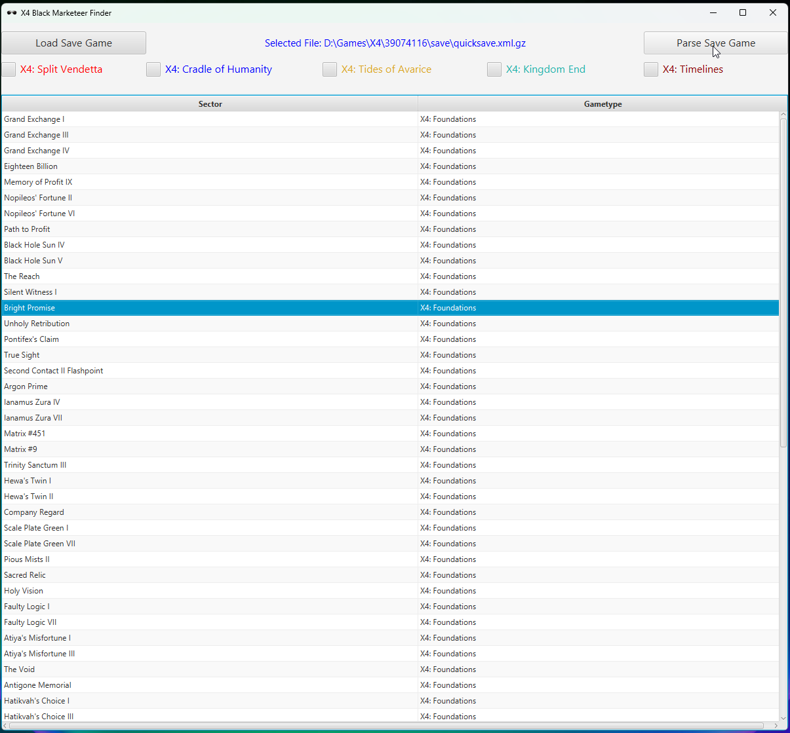

 # X4 Black Marketeer Finder
UI for parsing the X4: Foundations game saves to allow easier search for Black Marketer vendors to unlock Black market deals (selling Spaceweed, Maja Dust and Spacefuel)

## Instructions

### Install the .msi (Windows) or .deb (Linux Debian/Ubuntu/Mint) installation package

### Run X4 Black Marketeer Finder

* Load X4 save game (it's useful to link the save directory to the root of the drive for easier access )
* Select the sector to search for Black Marketeers (enables "Parse Save Game" button)
   * If sector is part of any DLC, enable the DLC via the checkbox.
   * Sectors can be sorted by name or Gametype

* After parsing the game for the sector, tool shows the stations in the sector, names and the status of black marketeers on them:
- None - shaded in grey - black marketeer not available on the station.
- Active - shaded in light green - black marketeer unlocked.
- Inactive (black marketeer still locked). If the player is near enough to the station, parser also shows number of voice (comm) leaks on the station.

## Types of signal leaks
* Data leak (red glowing orb) - scanning it provides discounts and blueprints 

 
* Comm leak (sparks flying out of it, static and voice talking ) - activating it provides Black Market mission and other illicit missions (boarding, hacking) and transport.

## Tips
- Enabling 'Signal Leak Indicator' in Accessibility Settings is very useful when searching for the leaks
- When a leak (either data or comm leak) is scanned, it doesn't appear anymore at the indicator.
- There is a possibility that station has unlocked black marketeer, but there are no comm leaks. This happens for unfinished stations and some special, plot related stations.

## Useful forum posts
- Spawning of Black Marketeers https://forum.egosoft.com/viewtopic.php?f=146&t=447260&start=20#p5133697
- Drug Plex adventures: https://forum.egosoft.com/viewtopic.php?f=146&t=428569

---
# Disclaimer
X4: Foundations and its DLCs (X4: Split Vendetta, X4: Cradle of Humanity, X4: Tides of Avarice,X4: Kingdom End, X4: Timelines) are the registered trademarks of the EGOSOFT GmbH (https://www.egosoft.com/).

This project is not affiliated with, endorsed by, or in any way officially connected to Egosoft GmbH. 

It is an independent tool created by the game fan, to assist gamers by parsing X4: Foundations game saves.

All trademarks, service marks, and company names are the property of their respective owners.

---

