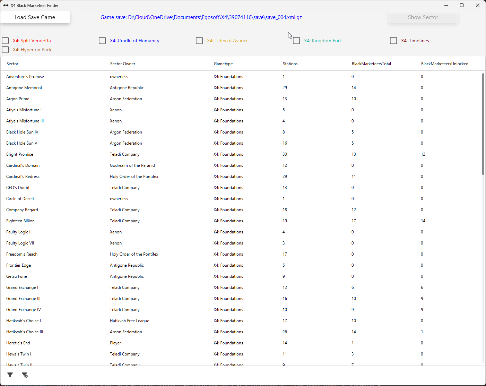
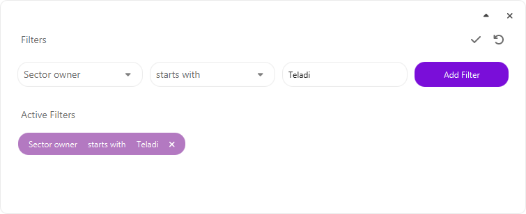
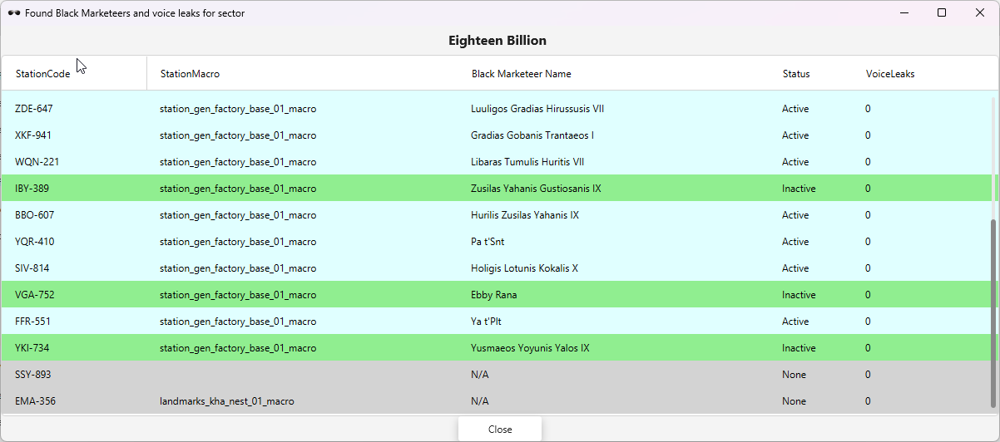
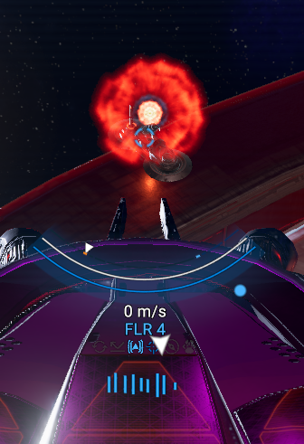

 # X4 Black Marketeer Finder
UI for parsing the X4: Foundations game saves to allow easier search for Black Marketer vendors to unlock Black market deals (selling Spaceweed, Maja Dust and Spacefuel)

## Instructions

### Install the .msi (Windows) or .deb (Linux Debian/Ubuntu/Mint) installation package

### Run X4 Black Marketeer Finder

* Load X4 save game (it's useful to link the save directory to the root of the drive for easier access )
* On loading the save game, progress dialog will be shown while the tool parses the save game and then updates the table with all sectors stored in the save game, having the:
   * Sector name (atm only supported English translation)
   * Game type (base game or DLC)
   * Number of stations in sector
   * Total number of black marketeers in the sector
   * Number of unlocked black marketeer vendors
* To show DLC sectors, enable it with the corresponding checkboxes.

   

* Sector table can be sorted by all columns and filtered with the controls on the bottom left side of the table:
  

* To display the detailed information about the stations and Black Market vendors, select the sector to display the data and click on the "Show Sector" button, or just double-click on the row.
* In the displayed dialog, tool shows the stations in the sector, names and the status of black marketeers on them:
   * None - shaded in grey - black marketeer not available on the station.
   * Active - shaded in cyan - black marketeer unlocked.
   * Inactive - shaded in light green - black marketeer still locked.
     *  If the player is near enough to the station -  there could be also generated voice leaks, so dialog also shows number of voice (comm) leaks on the station.

## Types of signal leaks
* Data leak (red glowing orb) - scanning it provides discounts and blueprints 

 
* Comm leak (sparks flying out of it, static and voice talking ) - activating it provides Black Market mission and other illicit missions (boarding, hacking) and transport.

## Tips
- Enabling 'Signal Leak Indicator' in Accessibility Settings is very useful when searching for the leaks
- When a leak (either data or comm leak) is scanned, it doesn't appear anymore at the indicator.
- There is a possibility that station has a black marketeer to unlock, but there are no comm leaks. This happens for unfinished stations and some special, plot related stations.

## Useful forum posts
- Spawning of Black Marketeers https://forum.egosoft.com/viewtopic.php?f=146&t=447260&start=20#p5133697
- Drug Plex adventures: https://forum.egosoft.com/viewtopic.php?f=146&t=428569

## Common issues
- Black Marketeers not generated for the base game sectors, in some specific circumstances: https://forum.egosoft.com/viewtopic.php?t=463823

---
# Disclaimer
X4: Foundations and its DLCs (X4: Split Vendetta, X4: Cradle of Humanity, X4: Tides of Avarice,X4: Kingdom End, X4: Timelines) are the registered trademarks of the EGOSOFT GmbH (https://www.egosoft.com/).

This project is not affiliated with, endorsed by, or in any way officially connected to Egosoft GmbH. 

It is an independent tool created by the game fan, to assist gamers by parsing X4: Foundations game saves.

All trademarks, service marks, and company names are the property of their respective owners.

---

